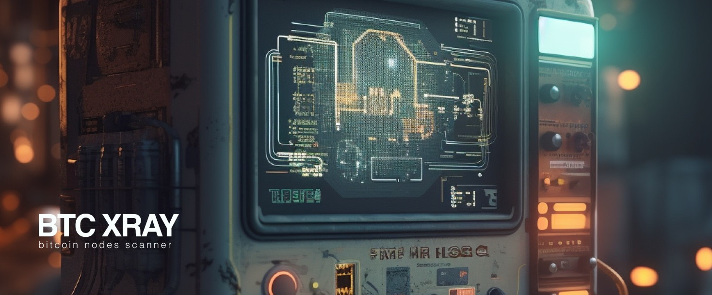

[](https://github.com/1F47E/go-btc-xray/actions/workflows/go.yml) [](https://goreportcard.com/report/1F47E/go-btc-xray)

<div align="center">
<br><br>
<h1>xray is a tool for scanning bitcoin network</h1>
<br><br>
</div>


### Features
```
- resolves seed nodes via DNS, 
- connects to nodes, performs handshake dance (version, verack, ping), 
- retrieves more node addresses from peers, 
- good nodes are saved to json file
```

<div align="center">
<a href="assets/screenshot.png">

</a>
<br><br>
</div>


### Run
```
go build -o xray

./xray
```
or to run with some envs
```
TESTNET=1 CONN=1 GUI=0 ./xray 
```

### Environment variables
```
GUI=0 - disables GUI (by default GUI is enabled)

TESTNET=1 - enables testnet network (by default mainnet is used)

DEBUG=1 - enables debug mode logging (by default logging level is info + limit connections)

DRY_RUN=1 - disables RPC client for debugging other stuff

GUI_MEM=1 - display memory usage in gui instead of messages

CONN=42 - overwrite maximum number of connections (by default debug 50, with debug=1 10)
```

### Protocol docs
https://en.bitcoin.it/wiki/Protocol_documentation


### TODO
- [ ] add a timer
- [ ] DB 
- [ ] API server
- [ ] download blocks
- [x] resolve seed nodes via dns
- [x] connect to nodes
- [x] do handshake (version, verack, ping)
- [x] get addr from peer
- [x] update and store peers
- [x] CLI GUI
- [x] gracefull shutdown
- [x] add msg window in gui


```
 __  __     ______     ______     __  __    
/\_\_\_\   /\  == \   /\  __ \   /\ \_\ \   
\/_/\_\/_  \ \  __<   \ \  __ \  \ \____ \  
  /\_\/\_\  \ \_\ \_\  \ \_\ \_\  \/\_____\ 
  \/_/\/_/   \/_/ /_/   \/_/\/_/   \/_____/ 
   bitcoin peers scanner
```
